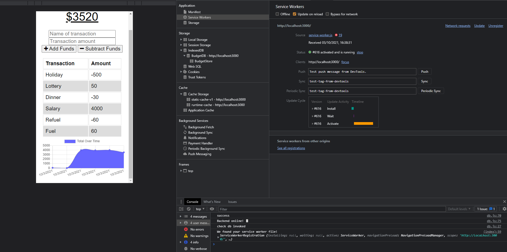
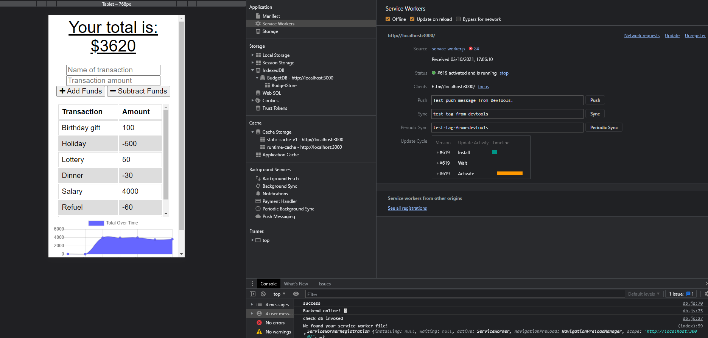
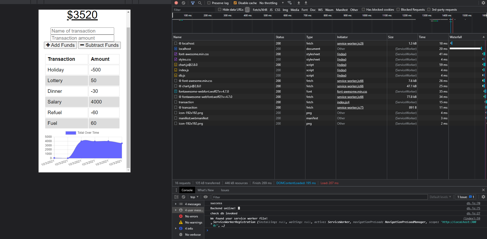

# Unit 19 PWA Homework: Online/Offline Budget Trackers

This is a budget tracker that allows users to track their budget both online and offline. This includes both deposits and expenses with data visualisation capabilities showing budget total over time. The app allows users to add expenses and deposits without a connection, which will then update when they are online. 

# User Story
AS AN avid traveller
I WANT to be able to track my withdrawals and deposits with or without a data/internet connection
SO THAT my account balance is accurate when I am traveling

# Business Context

Giving users a fast and easy way to track their money is important, but allowing them to access that information anytime is even more important. Having offline functionality is paramount to our applications success.

# Acceptance Criteria
GIVEN a user is on Budget App without an internet connection
WHEN the user inputs a withdrawal or deposit
THEN that will be shown on the page, and added to their transaction history when their connection is back online.

# Technologies used

This application relies on service workers to use cached assets first, thus providing a default experience even when offline. 

1. IndexDB
2. Express
3. MongoDB Atlas
4. Heroku

# Functionality demo

### Online mode

### Offline mode

### Served from ServiceWorker

# Deployed app

[Link to deployed application](https://budgettrackeriam.herokuapp.com/)

# Licenses
* MIT